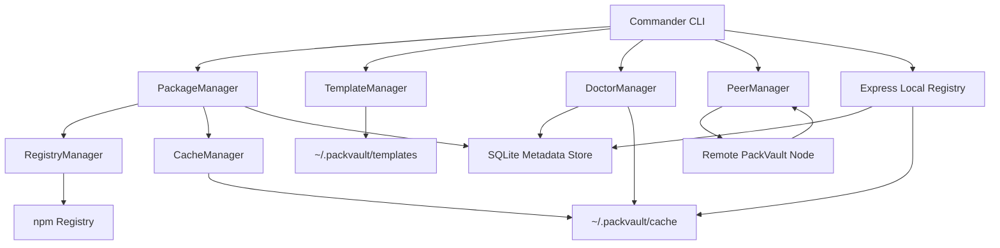

# PackVault Architecture

## System Diagram

## Modules

### CLI Layer

`src/cli/index.ts` owns command parsing, user-facing output, and exit codes. It creates the service graph and delegates work to managers. `src/cli/createWizard.ts` provides the offline Vite-style project wizard used by `packvault create`.

### Service Layer

- `PackageManager`: package sync, bundle sync, and offline install orchestration
- `CacheManager`: durable tarball writes, imports, existence checks, and storage usage
- `RegistryManager`: npm registry metadata resolution and tarball download
- `TemplateManager`: offline project template seeding and generation
- `BundleManager`: built-in bundle seeding and lookup
- `DoctorManager`: health, storage, and missing bundle package reporting
- `PeerManager`: peer recording and tarball import from remote PackVault nodes

### Infrastructure Layer

- `PackVaultDatabase`: SQLite schema initialization and typed repository methods
- `LocalRegistryServer`: Express server for health, metadata, tarball download, and LAN sharing
- `vaultPaths`: canonical `~/.packvault` directory layout

## TypeScript Interfaces

Core interfaces live in `src/types/index.ts`:

- `CachedPackage`
- `BundleDefinition`
- `PeerRecord`
- `NpmPackageMetadata`
- `NpmVersionMetadata`
- `SyncResult`
- `DoctorReport`
- `VaultPaths`

## Local Registry

The local registry currently exposes PackVault-native APIs:

- `GET /-/packvault/health`
- `GET /-/packvault/packages`
- `GET /-/packvault/tarball?name=<name>&version=<version>`
- `GET /:name` for npm-style package metadata for cached packages

This keeps the first version simple while preserving a path toward full npm registry compatibility.

## LAN Discovery Architecture

The implemented `connect` flow uses explicit IP-based peering. The architecture is ready for automatic discovery through:

1. UDP broadcast beacon: PackVault nodes periodically publish `{ hostname, port, packageCount }`.
2. mDNS service registration: advertise `_packvault._tcp.local`.
3. Peer reconciliation: discovered peers are upserted into the `peers` table.
4. Trust model: default to read-only tarball sharing, with future signed manifests before automatic imports.
5. Conflict handling: package identity is `name + version`; checksums should be added before remote overwrite support.

## Future Ecosystem Support

PackVault keeps package-system-specific logic behind manager boundaries:

- npm-specific registry behavior lives in `RegistryManager`.
- durable artifact storage lives in `CacheManager`.
- package records are generic enough to add ecosystem metadata columns or companion tables.

Future package managers can add adapters:

- `PythonRegistryManager` for PyPI wheels and sdists
- `CrateRegistryManager` for Rust crates
- `GoModuleManager` for Go module zip archives
- `DocsManager` for local documentation caches
- `RecommendationManager` for local AI suggestions using cached metadata
